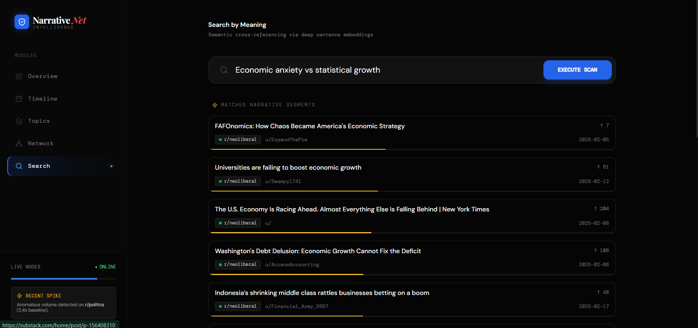
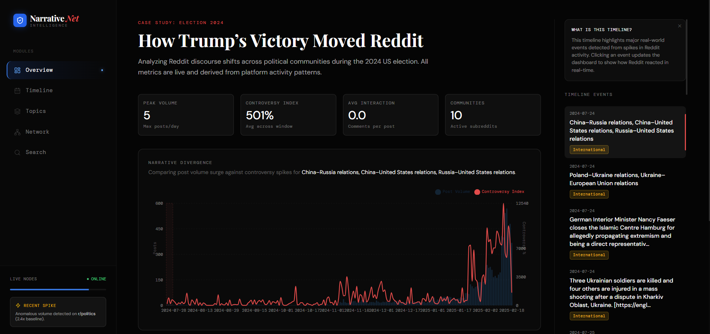
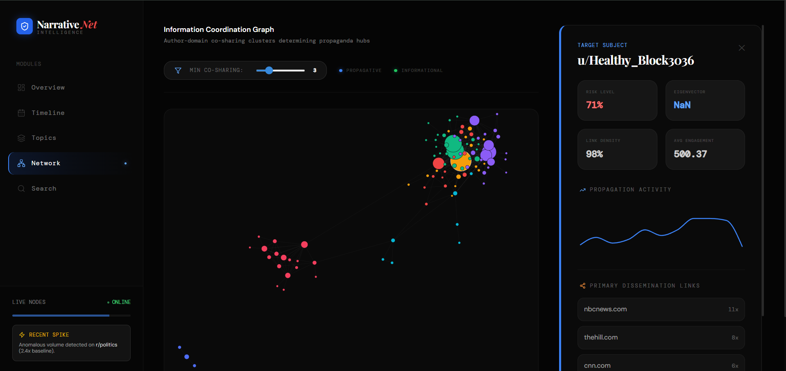
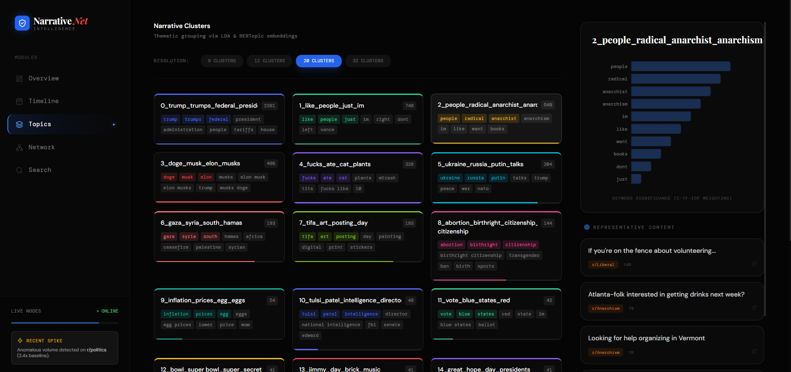
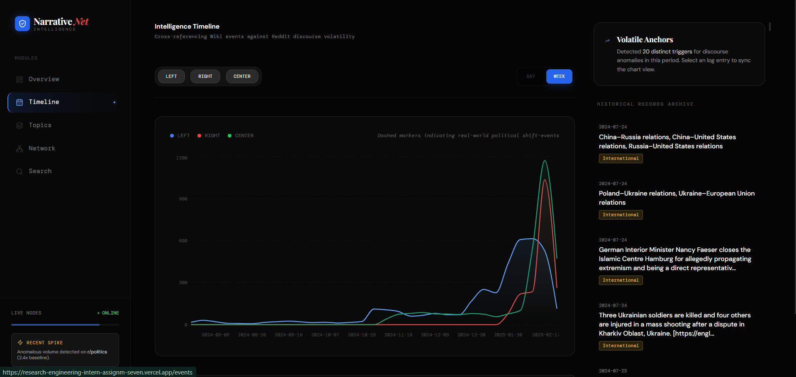
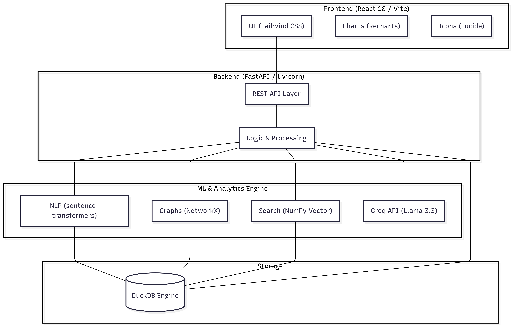

# SimPPL Digital Narratives Dashboard

An interactive research platform for tracing digital narratives, detecting sociological influence patterns, and analyzing the cascading spread of information across complex social networks.

Built for the SimPPL Research Engineering Internship, this dashboard ingests large-scale social media data to compute semantic embeddings, construct interaction graphs, and cluster nuanced topics using advanced ML pipelines—all served through a high-performance, editorial-grade dashboard interface.

## 🚀 Live Deployment

| Service | Platform | Status | URL |
| :--- | :--- | :--- | :--- |
| **Frontend UI** | Vercel | 🟢 Live | [https://research-engineering-intern-assignm-seven.vercel.app/](https://research-engineering-intern-assignm-seven.vercel.app/) |
| **Backend API** | Render | 🟢 Live | [https://narrativenet-backend.onrender.com](https://narrativenet-backend.onrender.com) |

## 🖼️ Feature Gallery

### 1. Semantic Search & AI Analysis
Experience narrative discovery through meaning rather than keywords. Powered by **Sentence-Transformers** and **Groq (Llama 3.3)**, the system identifies thematically similar posts even with zero keyword overlap.



### 2. Time Series & Intelligence Timeline
Track the temporal pulse of specific narratives. Our **DuckDB-backed** analytical layer provides sub-second aggregation for trend analysis across thousands of documents. Clicking events in the Intelligence Timeline highlights the exact discourse window on the graph.



### 3. Network Topography
A high-fidelity interaction graph showing the flow of influence. Nodes are sized by **PageRank** influence and colored by sociological cohort (**Louvain community detection**).



### 4. Topic Clustering
Dimensionality reduction and thematic clustering allow for a topographic map of current social discourses. Users can tune the number of clusters to find the right granularity for narrative analysis.



### 5. Automated Narrative Synthesis
An end-to-end AI-generated report that synthesizes complex datasets into a readable, journalistic long-form narrative, explaining spikes and discourse shifts in plain language.



## 🏗️ Architecture



## 🛠️ Technical Stack

- **Frontend**: React 18, Vite, Tailwind CSS 3, Recharts, Lucide.
- **Backend**: FastAPI (Python 3.11), Uvicorn.
- **Database**: DuckDB (High-performance analytical engine).
- **ML/Analytics**:
  - **NLP**: `sentence-transformers` (`all-MiniLM-L6-v2`).
  - **Graphs**: `NetworkX` (PageRank & Louvain).
  - **Search**: Vector similarity via `Numpy` dot-product.
  - **LLM**: `Groq API` (Llama 3.3) for narrative synthesis and AI analysis.

## ⚙️ Running Locally

### 1. Backend Setup
```bash
cd backend
python -m venv venv
# Windows:
.\venv\Scripts\activate
# Unix/macOS:
source venv/bin/activate
pip install -r requirements.txt
export GROQ_API_KEY="your_api_key"
python main.py
```

### 2. Frontend Setup
```bash
cd frontend
npm install
npm run dev
```

## 📝 Analyst Notes & Limitations
- **PageRank Filtering**: For large datasets, the Network graph uses PageRank to prioritize the most influential nodes for UI performance.
- **Cold Starts**: Initial API calls might experience slight latency on cloud platforms if the service has been idle.
- **Embedding Compute**: Semantic search depends on pre-computed embeddings. New data ingestions require a vectorization pass.

---
Built by **Tejas** for the SimPPL Research Engineering Assignment.
